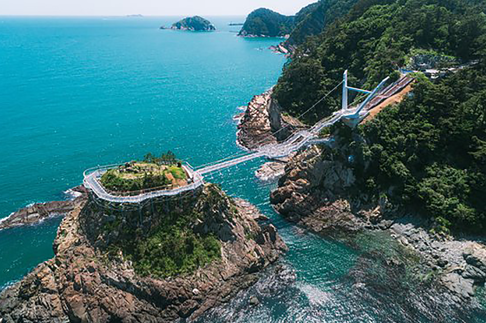

<!DOCTYPE html>
<html lang="en">
    <head>
        <title>Four season</title>
        <link rel="icon" type="image/x-icon" />
        <link href="https://fonts.googleapis.com/css?family=Montserrat:400,700" rel="stylesheet" type="text/css" />
        <link href="https://fonts.googleapis.com/css?family=Roboto+Slab:400,100,300,700" rel="stylesheet" type="text/css" />
        <link href="css/styles.css" rel="stylesheet" />
    </head>
    <body>
            

                
                </button>
                

                    <ul>
                        <li>Spring</a></li>
                        <li>Summer</a></li>
                        <li>Fall</a></li>
                        <li>Winter</a></li>
                    </ul>
                

            

        </nav>

        <header>
            

                
Welcome To My Website!

                
It's Nice To Meet You

            

        </header>
     
        <section>
            

                

                    <h2 class>Spring</h2>
                    <h3 class>Even the warm sunlight will shine on you.</h3>
                

                

                        

                            
                            

                                
안성팜랜드

                                
직접 만지고 먹이주며, 들꽃 한포기의 가치를 배우는 즐거운 체험목장, 안성팜랜드!
                                    칡소에서부터 황소, 당나귀, 면양, 거위등, 우리에게 소중한 가축들이 한자리에 모였습니다.
                                    탁 트인 초원에서 귀여운 가축들과 함께 뛰놀며 우리나라 농축산업의 소중함을 몸과 마음으로 느낄 수 있습니다.

                            

                        

                    

                    

                        

                            <a>
                            

                                
대구두류공원

                                
대구의 두류공원에서는 몽글몽글 차오른 노란 유채꽃이 드넓게 펼쳐져 있습니다.
                                    중간중간에 커다란 버드나무가 서있어서 더욱 아름답고 신비로운 분위기를 자아냅니다. 밤에는 조명과 어우러져 좀 더 아름다운 야경과 꽃을 
                                    함께 볼 수 있습니다.
                                

                            

                        

                    

                    

                        

                            
                            

                                
새학기

                                
거제 대금산은 진달래 명소로 이미 유명합니다. 천관산에서 장천재에 이르는 구간이 대표적인
                                    진달래 군락지입니다. 남해바다의 바다뷰와 함께 4월의 꽃을 함께 보며 같이 등산을 하며 힐링할 수 있습니다.
                                

                            

                        

                    

        </section>
         <section>
            

                

                    <h2>Summer</h2>
                    <h3>The hot sun shining in summer is always hot.</h3>
                

                

                    

                        

                            
                            

                                
부산 송도해수욕장

                                
동양의 나폴리라 불리는 송도 해수욕장은 우리나라 최초의 공설 해수욕장입니다.
                                    낮에는 해변 동쪽의 마련된 구름다리에서 바다뷰를 볼 수 있으며 밤에는 주변 야경과 어우러져 예쁜 풍경을 볼 수 있습니다.
                                

                            

                        

                    

                    

                        

                            
                            

                                
울산해파랑길

                                
'십리대숲'이라는 이름은 대나무 길이 약 10리나 이어져있을만큼 길다는 의미로 지어진 이름이라고 합니다. 
                                    그만큼 넓은 대나무길을 자랑하는 태화강 십리대숲, 울산 12경 중에 하나로 손꼽힙니다.
                                    국내 여름 여행지 울산 해파랑길 7코스 태화강 십리대숲에서  스치는 대나무의 소리에 귀도 귀울여보고, 태화강의 풍경을 보며 쉬어가보세요. 
                                

                            

                        

                    

                    

                        

                            
                            

                                
제주도

                                
여름에 더 가야 좋은 제주도. 제주도에는 여러가지 관광지와 바다가 어우러져 있어 관광객들이 휴식을 
                                    즐길 수 있습니다. 
                                

                            

                        

                    

        </section>
         <section>
            

                

                    <h2>Fall</h2>
                    <h3>The season when crops are ripe is always beautiful.</h3>
                

                

                    

                        

                            
                            

                                
하늘공원

                                
가을 하늘 공원의 뷰는 정말 아름답습니다. 억새와 코스모스 거기다가 핑크뮬리까지 
                                    걸으면서 느낄 수 있는 가을을 가까운 곳에서 즐길 수 있습니다. 예쁜 사진을 찍기엔 좋은 곳입니다.
                                

                            

                        

                    

                    

                        

                            
                            

                                
남이섬

                                
가을 남미섬에 붉고 노랗게 물들은 단풍잎들이 어우러져 아름다운 풍경을 
                                    볼 수 있습니다. 중간중간 다양한 형태의 지도들과 남미섬의 구성요소들을 보며 심심하지 않게 걸어다닐 수 있습니다.

                            

                        

                    

                    

                        

                            
                            

                                
순천만습지

                                
순천만 습지는 어느 계절에 와도 좋은 관광지인만큼 경치가 좋습니다. 그러나 
                                    산책길이 나무데크로 되어 있어 황금색으로 물들여진 들판들을 보면서 해가 질 무렵에 노을과 함께 전망대에서 아름다운 모습을 볼 수 있습니다.
                                

                            

                        

                    

        </section>
         <section>
            

                

                    <h2>Winter</h2>
                    <h3>Nothing is as white as snow in winter.</h3>
                

                

                    

                        

                            <a>
                                

                                
                            </a>
                            

                                
한라산

                                
눈에 쌓인 한라산의 모습은 가히 장관이라 할 수 있습니다. 눈에 쌓인 한라산을 보며 산 주위를 걷다 보면
                                    아름다운 모습을 볼 수 있습니다.
                                

                            

                        

                    

                    

                        

                            
                            

                                
대관령하늘목장

                                
대관령의 목장들에 눈 쌓인 모습을 보면 알프스 못지 않은 아름다운 모습을 볼 수 있습니다.
                                    하늘 목장은 다른 목장과 달리 마차를 타고 목장을 돌아다닐 수 있어서 이국적인 모습도 볼 수 있습니다.
                                

                            

                        

                    

                    

                        

                            
                            

                                
아침고요수목원

                                
가평군에 위치한 아침고요수목원 1990년대부터 현재에 이르기까지 우리나라의 아름다움을
                                    간직한 정원입니다. 겨울이 되면 어두운 밤에 화려한 불빛으로 되살아나 겨울의 감성과 아름다움을 느낄 수 있습니다.
                                

                            

                        

                    

        </section>
   
        <footer>
            

                

                    
Copyright &copy; Four season

                    

                        <a>Privacy Policy</a>
                        <a>Terms of Use</a>
                    

                

            

        </footer>
    </body>
</html>
